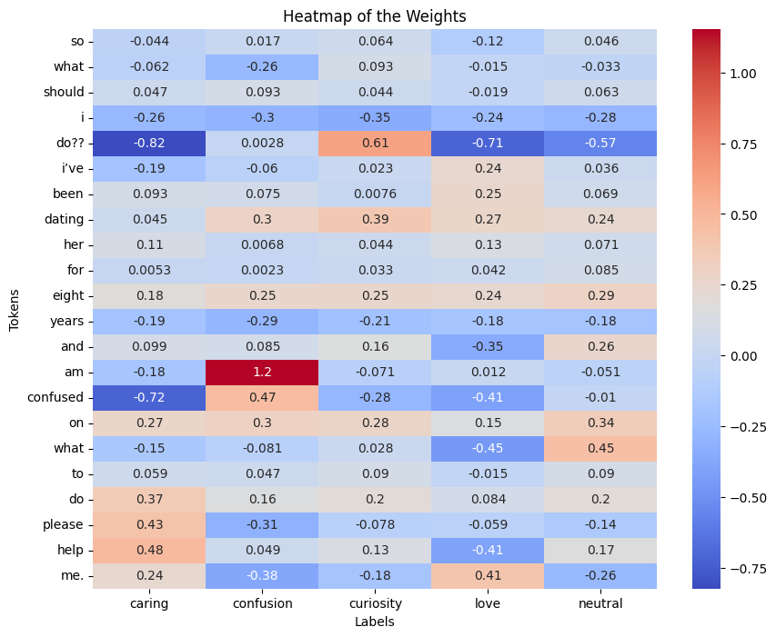

# Fine-Tuning-with-LoRA

This project, developed for the "Neural Networks for Data Science Applications" course, aims to explore a PEFT technique by fine-tuning the BERT model using LoRA for emotion classification on the GoEmotions dataset. The objective was to implement the LoRA fine-tuning technique from scratch in TensorFlow, training only 0.43% of the total model parameters, and compare its performance with a fully fine-tuned model where all weights were retrained.

## Fine-Tuning Results

Fine-tuning using LoRA parameters achieves good performance with significantly lower computational resources, reducing the number of trainable parameters from **10M** to **464K**. Although the accuracy (**73%**) is lower compared to fully fine-tuning (**94%**), this method offers faster iterations and is ideal for resource-constrained environments.

## Interpretation of the results with LIME

Following the approach outlined in the [Local Interpretable Model-agnostic Explanations (LIME)](https://arxiv.org/abs/1602.04938) paper, I replicated the mechanism to explain how the model classifies sentences. I created a simple logistic regression model (implemented as a neural network with no hidden layers) and analyzed how different tokens influence the predictions. An example of the results is shown below:

This insight on the model weights make as able to visually understand to on what the model gives importance to return his predictions and which are the relevant parts for each class. The result obtained are also consistent with what we could expect since we expect that the relevant tokens such as **['am', 'confused']** would have relevant weights given a sentence predicted with the label **confusion**, and so even the other classes.
